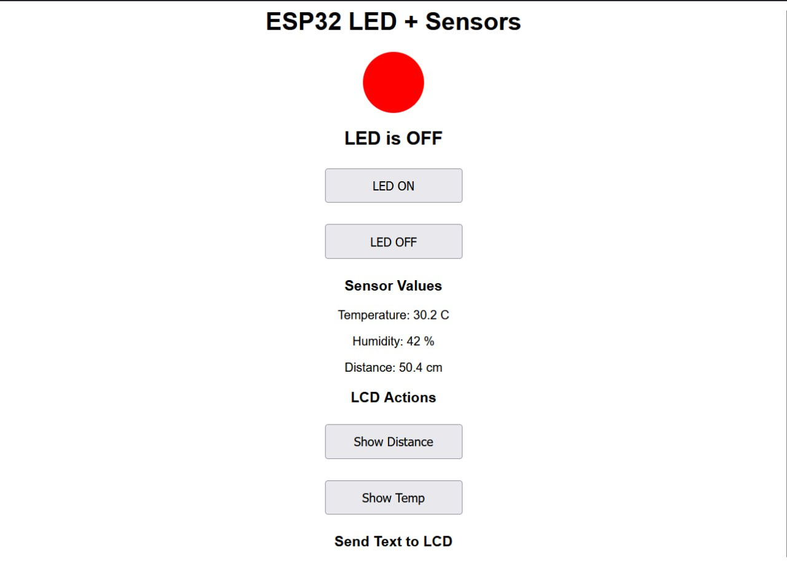

# LAB2: IoT Webserver with LED, Sensors, and LCD Control
# Team Members : 
- Meouk Sovannarith
- Vanthan Buth Yubendh
- Lim Houykea
- DETH Sokunboranich

## Task and Checkpoints

# Task 1 - LED Control

https://youtube.com/shorts/5NWhkgLTkqE

# Task 2 - Sensor Read

# Task 3 - Sensor -> LCD

# Task 4 - Textbox -> LCD

https://www.youtube.com/shorts/AwIc7ptWL_c

# Task 5 - Documentation 

## Wiring Diagram/Photo

Video Testing Everything:
https://youtube.com/shorts/NefKz8TcQ_I

## Set Up Instructions 

1. Configure both the lcd_api.py and machine_i2c_lcd.py files into the micropython board.
2. Save both the lcd_api.py and machine_i2c_lcd.py into the micropython board.
3. With the correct WIFI SSID and Password, run the lab2.py script.

## Usage Instructions 

1. The script will provide an IP to visit, that IP will be the website. Paste that to a browser and hit enter.
2. Test features with proper wiring to the ESP32 board.

NOTE : Custom text will override distance and temperature display, vice versa.
