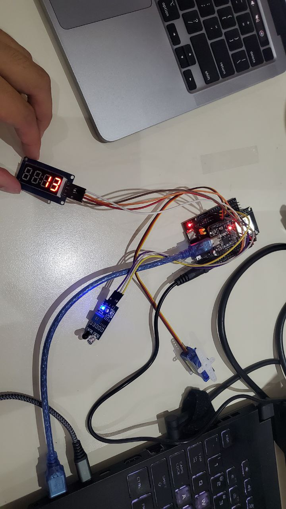
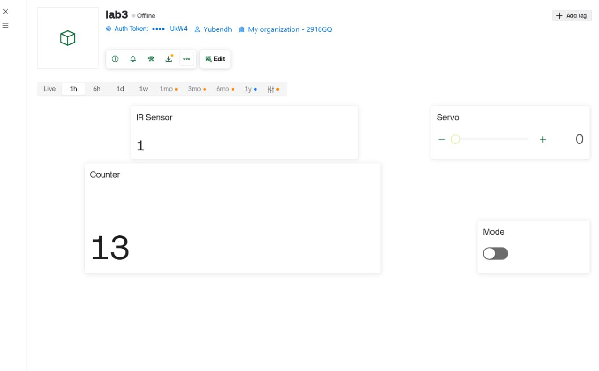

# LAB 3: IoT Smart Gate Control with Blynk, IR Sensor, Servo Motor,
# and TM1637
# Team Members : 
- Meouk Sovannarith
- Vanthan Buth Yubendh
- Lim Houykea
- DETH Sokunboranich

# Task 1 – IR Sensor Reading

    - 0 means nothing detected
    - 1 means detected

# Task 2 - Servo Motor Control Via Bylnk

https://www.youtube.com/watch?v=OBUu4KlQPW4

# Task 3 – Automatic IR - Servo Action

https://youtube.com/shorts/cQfoMVid_8U

# Task 4 – TM1637 Display Integration

https://youtu.be/yfCPwkAkgbo

# Task 5 - Manual Override Mode

https://youtu.be/aLlRcHgItZM

# Short Demonstration 

https://youtu.be/zxjLASbt5KA

## Wiring Photo 

## Blynk Dashboard

## SetUp Instructions 

1. import tm1637.py into esp32
2. make a template/dashboard on the Blynk Website and sync it with the Blynk Mobile App for usages later
3. add all these as virtual pins through datastream
    - add 1st one for integer
    - 2nd one for slider
    - 3rd one for counter
    - 4th one for switch

4. save and apply
5. copy the token to the lab3.py
6. run lab3.py

## Usage Instructions 

1. While the script is running you can: 
    - test/control it in the website dashboard or the mobile app dashboard. 
    - Test the IR Sensor by placing an obstacle over it to interact with the Motor.
    - OR Control/Test the IR Sensor and Servo Motor via the Dashboards.
    - There's a Mode Switch to overide the automatic IR Sensor mode(while on, IR Sensor automactic sensor is ignored)
    - There's a counter to count the amount of IR Sensor counts.

2. Stop the script to end testing.
