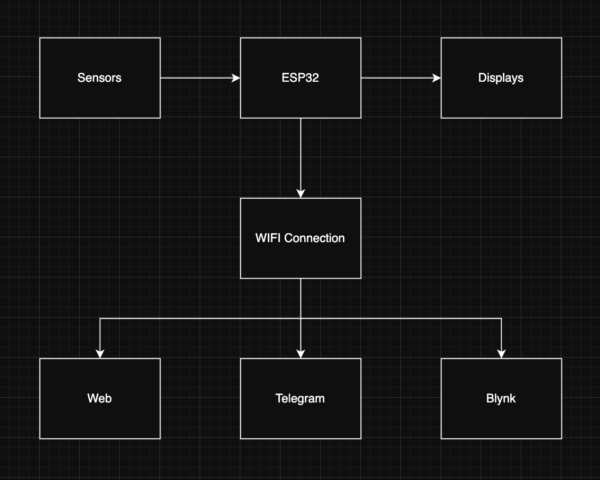
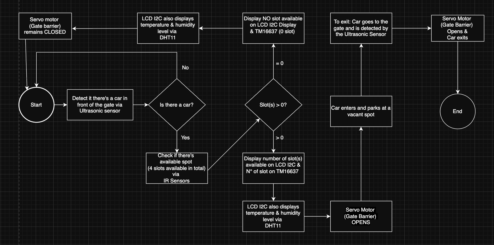
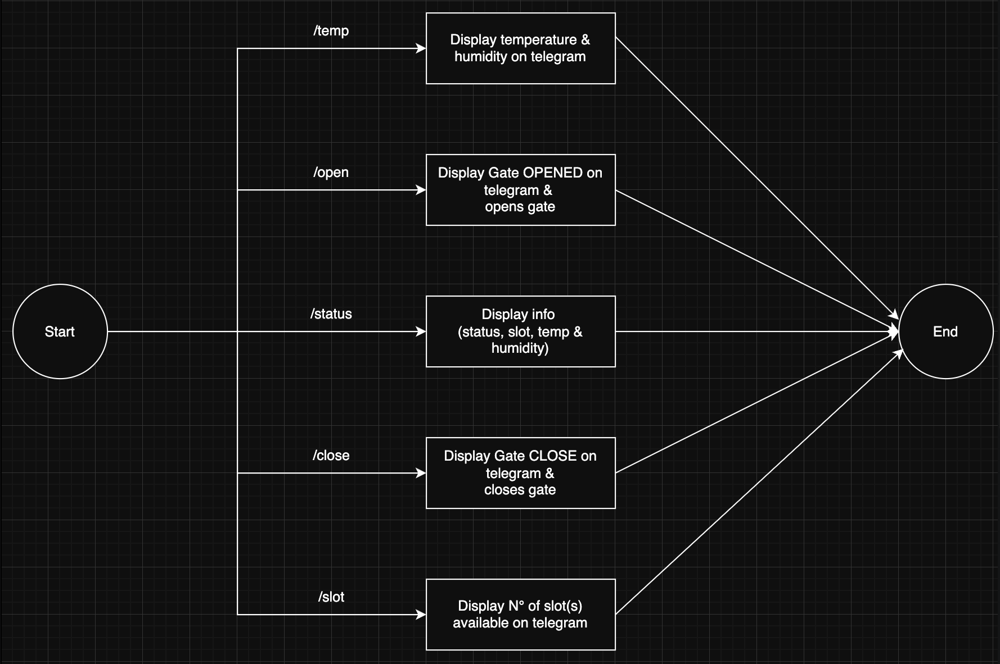
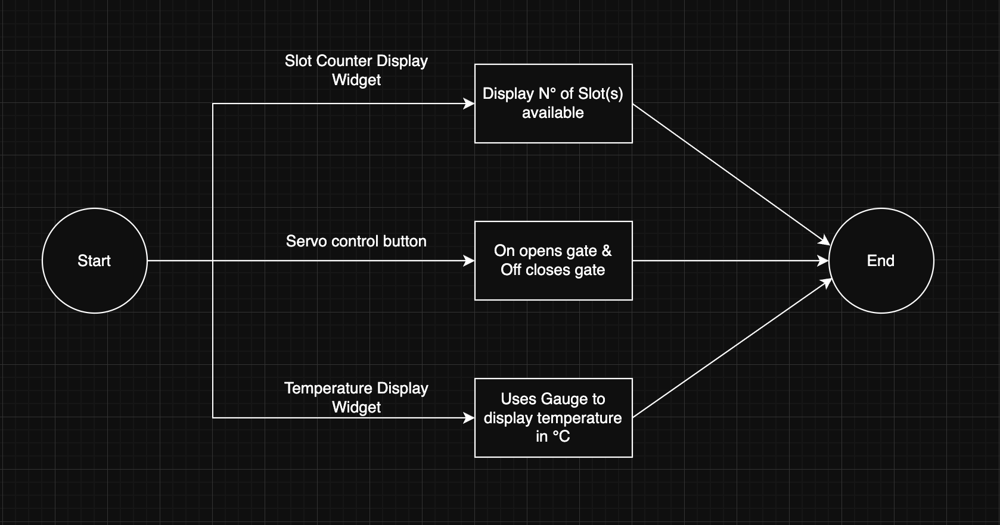
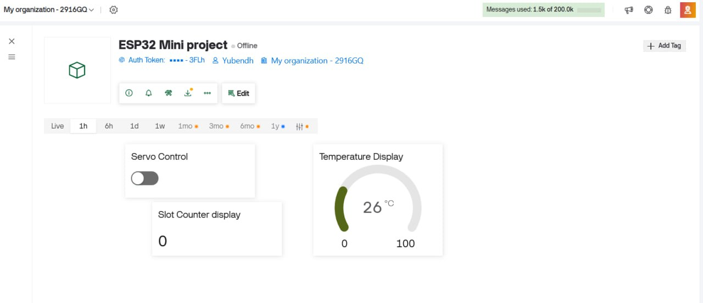
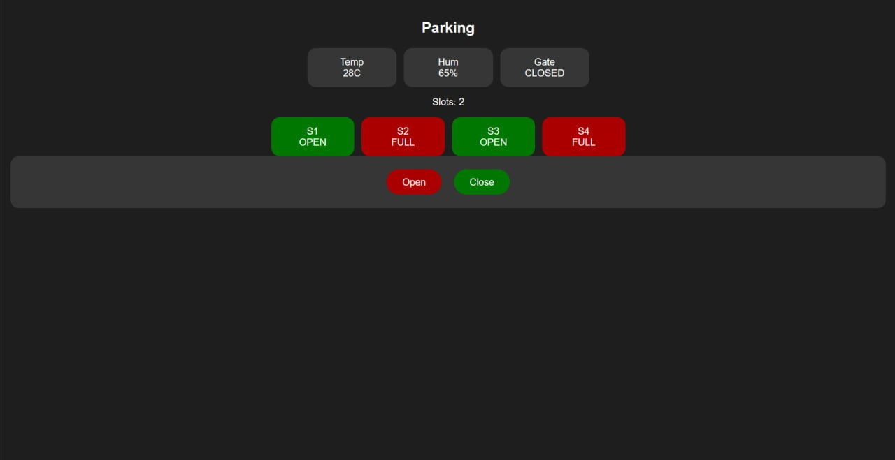

# IoT Smart Parking Mini-Project
# By Group 3

## Team Members
- Deth Sokun Boranich
- Lim Houykea
- Vathan Buth Yubendh
- Meouk Sovannarith

## Video Link

https://youtu.be/3SbwCCiBTTA

## I. Introduction

This project aims to simulate a real parking lot, built with different sensors and smart features implemented for a more modern take on how parking lots should be managed. Everything is fully automated with multiple dashboards and UIs to control things like closing and opening of the gate barrier and viewing the status/outputs of various sensors.

Below is a more detailed explanation of the hardware and software architecture of the project, as well as the different components used in the project.

## II. Hardware Description

- **ESP32** : The brain of the entire system, and handles things such as Telegram bot hosting, web server hosting, Blynk, and all the sensors and motors.
- **Servo Motor** : Controlled by several factors, such as manual input from Telegram bot commands, Blynk dashboard controls, Web server UI control, as well as automated opening through detection from sensors such as IR sensors and Ultrasonic sensors.
- **IR Sensors** : Used to detect objects, mainly used to detect if a car is in front or not.
- **Ultrasonic Sensors** : Used to detect objects and the distance of the object from the sensor. Mainly for the car to test the automation of the gate barrier.
- **DHT11** : Detecting and outputting temperature and humidity.
- **TM1637** : Displaying the number of slots occupied.
- **LCD I2C** : Used for displaying status/outputs from DHT11 and other sensors.

## III. System Architecture

Main System Architecture Diagram:

The entire project runs on **MicroPython via the Thonny IDE**, which integrates sensors mentioned above and actuators with three remote interfaces:

1. Web dashboard
2. Telegram bot
3. Blynk dashboard

It mainly relies on one shared controller that owns the hardware state and executes all the commands.

## IV. Software Architecture

Files used:

- **main.py** : Main parking loop and control logic.
- **config.py** : Pin map and behavior settings.
- **tm1637.py** : TM1637 display driver.
- **lcd_api.py, machine_i2c_lcd.py** : LCD I2C driver.
- **telegram_bridge.py** : runs the Telegram bot externally and acts as a bridge that forwards commands and status updates between the Telegram and the ESP32.

The software architecture follows a centralized control pattern. The main.py file acts as the main controller of the system. It continuously reads sensor data, updates the system state, applies automation logic, and refreshes the displays. This file functions as the core loop that runs the entire system and coordinates all operations.

Due to the limited RAM available on the ESP32, running the Telegram bot directly on the microcontroller can cause performance and memory issues. To solve this problem, the Telegram bot is executed in a separate script called telegram_bridge.py on an external machine.

External services do not directly control the hardware components. Instead, they interact with the system through a shared command router, which is responsible for processing requests and executing the appropriate actions.

This design helps reduce duplicated logic and ensures that the gate behavior and system responses remain consistent across all interfaces, including the Telegram bot, web dashboard, and Blynk dashboard.

## V. IOT Integration

Main Integration:

The system connects to the internet through the ESP32 WiFi module, allowing communication with multiple IoT platforms for remote monitoring and control.

The Telegram Bot allows users to send commands and receive system updates through chat.

The Web Dashboard provides a browser-based interface to view system status and manually control features such as the gate.

The Blynk App offers a mobile and web dashboard where users can monitor sensor data and control the system remotely.

Together, these platforms enable users to interact with the smart parking system from anywhere with an internet connection.

> **NOTE:**
> - Change pins in config.py to match the wiring on your ESP32.
> - IR sensors are configured as active-low (0 = occupied). Change IR_ACTIVE_LOW in config.py if needed.
> - If your servo direction is reversed, swap SERVO_OPEN_ANGLE and SERVO_CLOSED_ANGLE in config.py.
> - TM1637 shows the slot number when available, and FULL when no slot remains.

## VI. Working Process Explanation

Main System Flowchart:

Telegram bot flowchart:

Blynk Web/Mobile-app flowchart:

Web Dashboard:

From the flowchart:

1. Ultrasonic detects an incoming car.
2. System checks real-time slot availability from 4 IR sensors.
3. If slot available: TM1637 shows count, gate opens (servo), then closes.
4. If no slot: TM1637 shows FULL, gate stays closed.
5. LCD shows slots + system status / DHT11 temperature & humidity.

To run:

1. Copy all files in this folder to the ESP32.
2. Ensure MicroPython firmware is installed on ESP32.
3. Run main.py (or rename to boot.py / main.py on board startup).

## VII. Challenges Faced

During the development of this project, several challenges were encountered.

1. One major challenge was the limited RAM of the ESP32, which made it difficult to run all services at the same time. So, to work around this, we decided to have a bridge file for Telegram called telegram_bridge.py to test the Telegram features.
2. Another challenge was integrating multiple IoT platforms, such as Telegram, Blynk, and the Web Dashboard, into a single system that could all run seamlessly.
3. The team also faced issues with sensor accuracy, which required testing and adjustments of the system physically.
4. Additionally, debugging MicroPython code and ensuring stable communication between components took a considerable amount of time.

## VIII. Future Improvements

Below is a list of future improvements our team would like to tackle:

1. A camera system could be added for license plate recognition to automatically identify a specific vehicle.
2. A database or cloud storage could also be integrated to store parking history and system data for future analysis.
3. The system could support more parking slots and sensors to manage larger parking areas.
4. Improving the user interface of the web dashboard and mobile app by adding more features would also make the system feel more usable.
